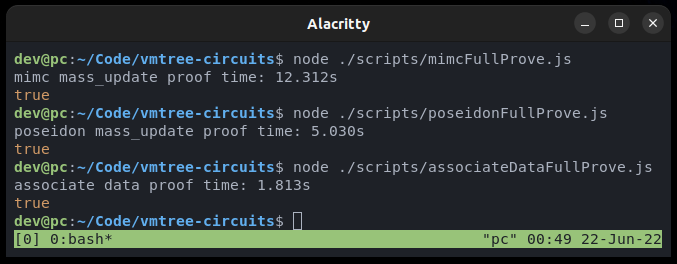

# Verifiable Merkle Tree Circuits
VMTree uses SNARKs to do trust minimized merkle tree updates. This repository contains two implementations, one using the MiMCSponge hash function, and one using the Poseidon hash function.

# Dependencies
 - [circom compiler](https://docs.circom.io/getting-started/installation/)
 - [snarkjs](https://github.com/iden3/snarkjs.git)

## Install
Clone the repo and install yarn/npm deps
```sh
$ git clone https://github.com/vmtree/circuits.git vmtree-circuits
$ cd vmtree-circuits
$ yarn
```

Setup the circuits. Be warned, this downloads ~755 MB of files. The mimc circuit requires a powers of tau file that's 600 MB, while the poseidon circuit requires a powers of tau file that's only 151 MB.
Setup the Poseidon VMTree:
```sh
$ ./scripts/setup_poseidon.sh
```
Setup the MiMCSponge VMTree:
```sh
$ ./scripts/setup_mimc.sh
```
Setup the Poseidon ZK Merkle Proof Circuit (This is the consumer of the VMTree).
```sh
$ ./scripts/setup_poseidon_associate_data.sh
```

## Test
Run to generate and verify a zkp for a random VMTree update using the Poseidon hash function.
```sh
$ node ./scripts/poseidonFullProve.js
```

Run to generate and verify a zkp for a random VMTree update using the MiMCSponge hash function.
```sh
$ node ./scripts/mimcFullProve.js
```

Run to generate and verify a zkp proof of membership: a merkle proof in zero knowledge that is associated with arbitrary public data and with configurable nullifier hashes.
```sh
$ node ./scripts/associateDataFullProve.js
```

## Proof times
Poseidon is able to accommodate more deposits than MiMC, yet has smaller proving keys and a faster proof generation time. The associate data proof is fast which is nice because it is typically performed in a web browser by a user interacting with some dapp.


# Circuits

## mimc
The mimc is the original circuit, but is not efficient. It's deprecated moving forward, but I'm including it here to benchmark against poseidon. The mimc circuit uses tree depth of 20 and a batch size of 10. Notably, 10 is not a factor of 2^20, so this circuit required a "single batch" update as well to be able to fill in the last few slots of the tree.

## poseidon
The poseidon circuit requires far less constraints -- we were able to increase the amount of leaves in each batch to 16, and the circuit still has proving keys that are smaller and more efficient than the mimc circuit. The batch size being 16 means we can fill the tree completely without requiring a "single batch" update circuit. It also means that the deposits cost is amortized even further than before, being closer to 1/16 than 1/10. However, depositors will have to wait 1.6 times longer before they can withdraw.

## associate_data
The way this circuit is designed allows it to be used for mixing, voting, or airdrops, to name a few. The merkle proof is done in zero knowledge, which allows a prover to show that they belong to a set of commitments (e.g., they deposited a commitment into a mixer, or they are a member of a zk voters merkle tree) without revealing which commitment is theirs. Then, the prover attaches some public data that is meaningful to the protocol (e.g., the fee data and recipient of a mixer withdrawal, or the vote decision chosen by the private voter). The arbitrary data can be hardcoded at the smart contract level without requiring to make new circuits. Furthermore, we allow for multiple nullifier values to be used by adding an offset parameter, which would allow for each commitment to be used twice in the same tree. This feature may be unnecessary but I think it has a unique purpose that makes the circuit even more generalizable. It can be hardcoded to simply only use one offset to recover the single-action characteristic that prevents double spends in mixers.