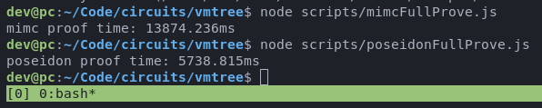

# Verifiable Merkle Tree Circuits
VMTree uses SNARKs to do trust minimized merkle tree updates. This repository contains two implementations, one using the MiMCSponge hash function, and one using the Poseidon hash function.

# Dependencies
 - [circom compiler](https://docs.circom.io/getting-started/installation/)
 - [snarkjs](https://github.com/iden3/snarkjs.git)

## Install
Clone the repo and install yarn/npm deps
```sh
$ git clone https://github.com/vmtree/circuits.git vmtree-circuits
$ cd vmtree-circuits
$ yarn
```

Setup the circuits. Be warned, this downloads ~755 MB of files. The mimc circuit requires a powers of tau file that's 600 MB, while the poseidon circuit requires a powers of tau file that's only 151 MB.
```sh
$ ./scripts/setup_poseidon.sh
```

```sh
$ ./scripts/setup_mimc.sh
```

## Test
Run the full proof scripts
```sh
$ node ./scripts/poseidonFullProve.js
```

```sh
$ node ./scripts/mimcFullProve.js
```

# Circuits

## mimc
The mimc is the original circuit, but is not efficient. It's deprecated moving forward, but I'm including it here to benchmark against poseidon. The mimc circuit uses tree depth of 20 and a batch size of 10. Notably, 10 is not a factor of 2^20, so this circuit required a "single batch" update as well to be able to fill in the last few slots of the tree.

## poseidon
The poseidon circuit requires far less constraints -- we were able to increase the amount of leaves in each batch to 16, and the circuit still has proving keys that are smaller and more efficient than the mimc circuit. The batch size being 16 means we can fill the tree completely without requiring a "single batch" update circuit. It also means that the deposits cost is amortized even further than before, being closer to 1/16 than 1/10. However, depositors will have to wait 1.6 times longer before they can withdraw.

